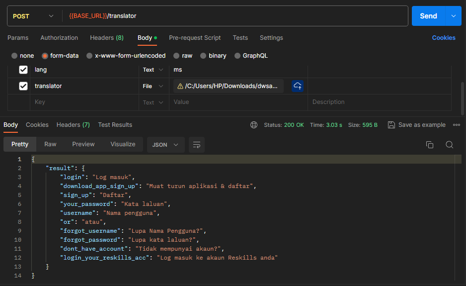

# Google Translator For JSON File

This is a language translator with JSON file as input. It is made with node js & [google-translate-api-browser](https://www.npmjs.com/package/google-translate-api-browser). You need to upload a json file & the language code to get the desired output.

## Output

---
## Requirements

For development, you will only need Node.js and a node global package, npm, installed in your environement.

### Node
- #### Node installation on Windows

  Just go on [official Node.js website](https://nodejs.org/) and download the installer.
Also, be sure to have `git` available in your PATH, `npm` might need it (You can find git [here](https://git-scm.com/)).

- #### Node installation on Ubuntu

  You can install nodejs and npm easily with apt install, just run the following commands.

      $ sudo apt install nodejs
      $ sudo apt install npm

- #### Other Operating Systems
  You can find more information about the installation on the [official Node.js website](https://nodejs.org/) and the [official NPM website](https://npmjs.org/).

If the installation was successful, you should be able to run the following command.

    $ node --version
    v21.5.0

    $ npm --version
    10.2.4

If you need to update `npm`, you can make it using `npm`! Cool right? After running the following command, just open again the command line and be happy.

    $ npm install npm -g

###

---

## Install

    $ git clone https://github.com/SirRatul/Language-Translator
    $ cd Language-Translator
    $ npm install

## Running the project

    $ npm start
